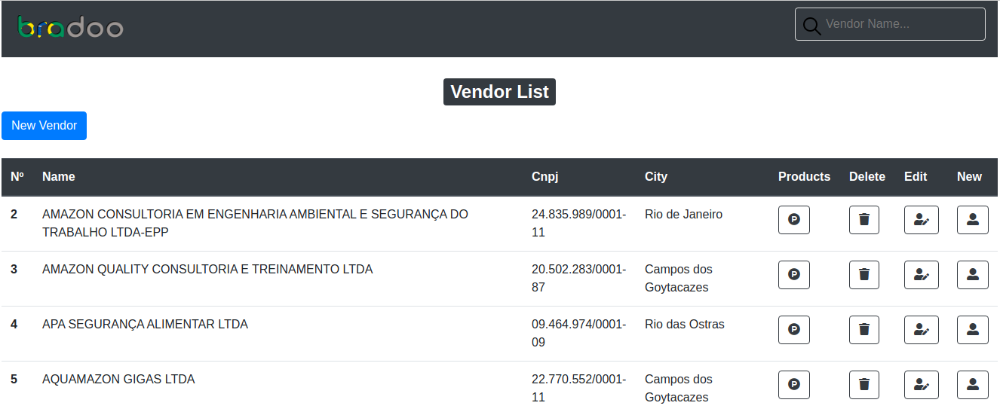
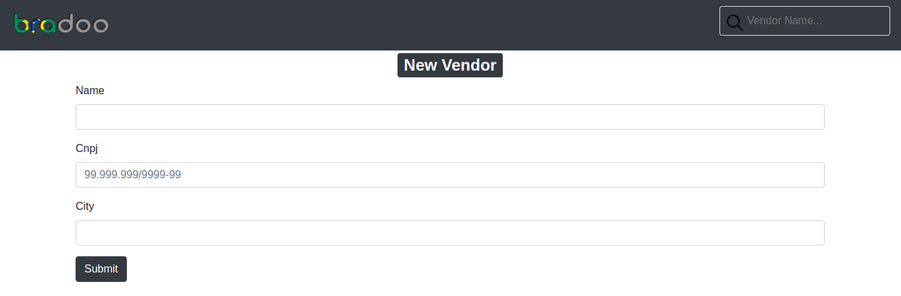
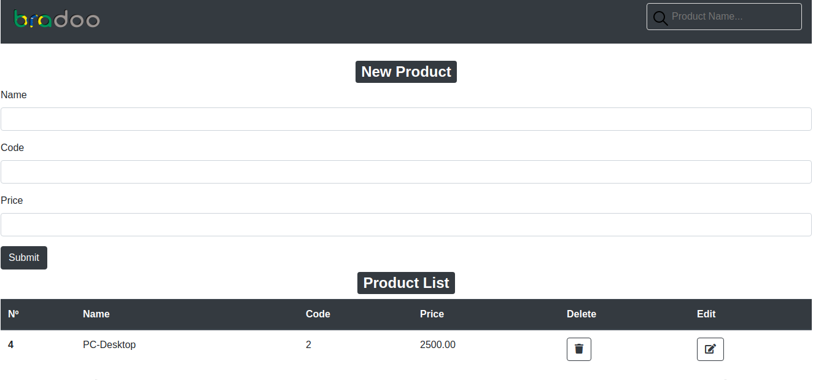

# bradoochallenge
Vendor Catalogues Frontend
# Description

In this sample application, you will create a frontend application using Django to 'CRUD' vendors and yours respectives products, with standard best practices and respecting the rules.

## Steps

### Execute web service
You can get started building this application locally, but you can either run the application in web using the heroku link host web (https://frontbradoo.herokuapp.com/).

### Building Locally

* Install [Python](https://www.python.org/downloads/)

Running Django applications: You can download the project dependencies with:

```bash
pip install -r requirements.txt
python manage.py migrate
```

To run your application locally:

```bash
python manage.py runserver
```

Your application will be running at `http://127.0.0.1:8000`. 


<h1 align="center">


</h1>

<h1 align="center">

</h1>

<h1 align="center">

</h1>


